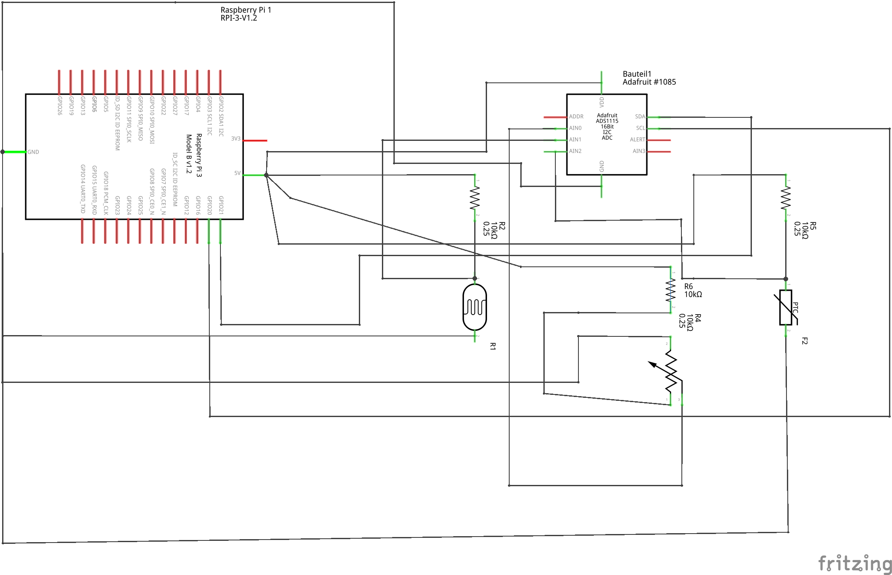

# Sensordatenübertragung

Dieses Projekt befasst sich mit der Erfassung, Übertragung und Speicherung von Sensordaten. Die Daten werden sowohl lokal als auch auf einem Server gespeichert und können über eine grafische Benutzeroberfläche visualisiert werden.

## Inhaltsverzeichnis

- [Überblick](#überblick)
- [Sensordatenformat](#sensordatenformat)
- [Funktionalität](#funktionalität)
- [Installation & Einrichtung](#installation--einrichtung)
- [Verwendung](#verwendung)
- [Datenbankintegration](#datenbankintegration)
- [GUI-Datenvisualisierung](#gui-datenvisualisierung)
- [Automatisierte Datenübertragung](#automatisierte-datenübertragung)
- [Anwendungsbeispiel](#Anwendungsbeispiel)
- [Lizenz](#lizenz)

## Überblick

Das Projekt ermöglicht die Übertragung von Sensordaten über eine serielle Schnittstelle oder per Dateiimport. Die Daten werden analysiert, gespeichert und können über verschiedene Schnittstellen weiterverarbeitet werden.

## Sensordatenformat

Die Sensordaten folgen einem standardisierten Format:

```plaintext
:T00+000.1;
```

**Bedeutung der Komponenten:**

| Zeichen | Bedeutung        |
| ------- | ---------------- |
| `:`     | Startzeichen     |
| `T`     | Sensortyp        |
| `00`    | Sensor-ID        |
| `+`     | Vorzeichen       |
| `000.1` | Messwert         |
| `;`     | Abschlusszeichen |

## Funktionalität

- **Echtzeit-Datenverarbeitung** über serielle Schnittstelle
- **Speicherung** der Messwerte in SQLite und MariaDB
- **CSV-Export** zur Weiterverarbeitung
- **Grafische Visualisierung** der Messwerte mit Matplotlib oder bei SensorDia.java mit JFreeChart

## Installation & Einrichtung

### Voraussetzungen

- Raspberry Pi 3b+ (oder kompatibles System)
- Python 3 mit erforderlichen Bibliotheken
- MariaDB-Server für serverseitige Speicherung

### Installation

```bash
sudo apt update && sudo apt install -y python3 python3-pip mariadb-server
pip3 install -r requirements.txt
```

## Verwendung

### Start des Programms

Das Hauptskript wird mit einem Sensordaten-String als Parameter gestartet:

```bash
python main.py ":T01+015.1;"
```

Die Ausgabe enthält:

1. Den Original-String
2. Zerlegte Werte (Sensortyp, ID, Vorzeichen, Wert)
3. Zeitstempel (normal und als Unix-Timestamp)
4. Speicherung der Werte in Datenbanken und CSV

## Datenbankintegration

**MariaDB-Setup:**

```sql
CREATE DATABASE WerteDB;
CREATE TABLE messwerte (
    id INTEGER PRIMARY KEY,
    datum TEXT,
    sensorName TEXT,
    Wert TEXT
);
```

## GUI-Datenvisualisierung

Eine GUI-Anwendung erlaubt die Auswahl eines Sensors und zeigt dessen Messwerte als Diagramm.

### Starten der GUI

```bash
python GUIDia.py
```

## Automatisierte Datenübertragung

Ein Bash-Skript `transfer.sh` kann Sensordaten automatisch an einen Server senden.

```bash
./transfer.sh
```

## Anwendungsbeispiel

### Voraussetzungen

- 1x Raspberry Pi 3B+
- 1x ADS1115
- 3x 10KOhm Widerstände (1x Pro Komponente)
- 1x Potentiometer
- 1x LDR
- 1x NTC


### Schaltplan

Wenn ihr einen ADS1115 Mikrocontroller habt, könnt ihr Sensorwerte z.B. von einem Potentiometer, einem PTC (Kaltleiter) oder einem LDR (Fotowiderstand) einlesen. Die Codes können frei geändert werden. Updates folgen


Um den Code auf dem Pi zu implementieren, folgen Sie diesem Schaltplan.

Belegung von den Microcontroller:

- A0: Potentiometer
- A1: LDR
- A2: NTC




## Lizenz

 
